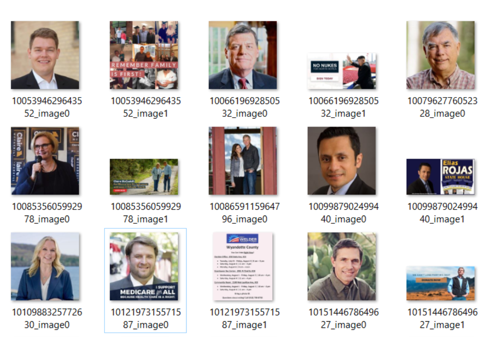

# Facebook Ad Scraper
Downloads all the image and video content from Facebook ads queried on the Facebook API (focusing on political ads). 

The [Wesleyan Media Project](http://mediaproject.wesleyan.edu/) tracks and analyzes all broadcast ads aired by federal and state election candidates in every media market in the country. The collected data will be leveraged by researchers to "enhance the ability of scholars, citizens, and journalists to hold government accountable by providing public information on how special interests are attempting to influence American democracy."



🤜[See my presentation here](https://docs.google.com/presentation/d/1cDreU-XPTi4TSJ0hSVwlSqHeIr6vQ6d9-OVRsWXOOBk/edit?usp=sharing)

# Usage
Get all the media links + download all images and video in batch sizes of 100. 
```
git clone https://github.com/fredcorpuz06/fb-ads-scraper.git
cd fb-ads-scraper
python dwnld-fb-ads.py
```

Change batch size to 10. To provide your username and password, change `./data/fb.pw` or type on terminal
```
python dwnld-fb-ads.py 10 yourEmail@gmail.com SecretPassword
```
For long downloads, use `nohup` to ensure your session isn't aborted
```
nohup python dwnld-fb-ads.py > ./output/console-log.txt &
```


# Tools Used
* **selenium chromedriver**: scrape image and video links
* **aria2c**: download image and video content given a URI
